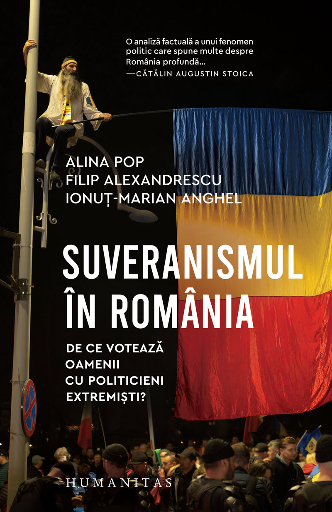

::: {.hero}

# Compas Social România

**Platformă independentă de cercetare socială, analiză a politicilor publice și dezbatere privind transformările sociale, economice și politice din România.**

Compas Social România reunește proiecte de cercetare, publicații academice, analize publice, hărți interactive, apariții media și profiluri ale cercetătorilor asociați.

::: {.hero-buttons}

[Proiecte](proiecte.qmd){.btn .btn-primary}
[Publicații](publicatii.qmd){.btn .btn-outline-primary}
[Media](mass-media.qmd){.btn .btn-outline-secondary}

:::

:::

## Direcții de cercetare {.section-title}

::: {.cards}

::: {.card}

### Politici publice și inegalități

Analize privind transformările statului social, politicile publice, inegalitățile sociale și efectele reformelor economice asupra grupurilor vulnerabile.

:::

::: {.card}

### Marginalizare urbană și minorități

Cercetări despre locuire, marginalitate urbană, guvernanța minorităților etnice și procesele de excluziune socială în România și Europa de Est.

:::

::: {.card}

### Comportament electoral și suveranism

Analize teritoriale și sociologice privind votul, participarea politică și ascensiunea curentelor suveraniste și radicale de dreapta.

## Proiecte și resurse recente {.section-title}

::: {.book-card}

::: {.book-cover}

:::

::: {.book-info}
### Rădăcinile sociale ale votului suveranist la alegerile din 2024–2025

Proiect editorial și analitic dedicat înțelegerii condițiilor sociale, teritoriale și politice care au contribuit la susținerea candidaților și partidelor suveraniste în România.

Rezultatele proiectului sunt dezvoltate în volumul:

**Suveranismul în România. De ce votează oamenii cu politicieni extremiști?**  
Humanitas, 2026.

[Vezi cartea la Humanitas](https://humanitas.ro/humanitas/carte/suveranismul-in-romania){.btn .btn-primary}
:::

:::

### Hărți interactive

Acces la aplicații interactive privind rezultatele electorale la nivel de unitate administrativ-teritorială.

[Vezi proiectele](proiecte.qmd)

:::

::: {.card}

### Publicații

Cărți, articole academice și rapoarte relevante pentru direcțiile de cercetare ale platformei.

[Vezi publicațiile](publicatii.qmd)

:::

::: {.card}

### Mass-media

Interviuri, podcasturi și apariții în presă ale cercetătorilor asociați platformei.

[Vezi aparițiile media](mass-media.qmd)

:::

:::